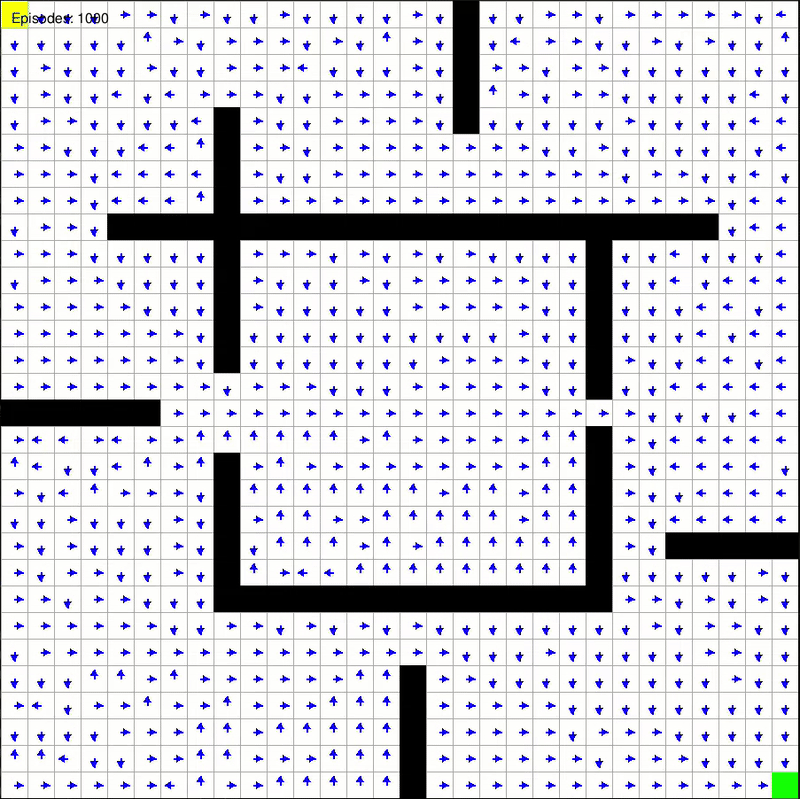

# qlearning-maze-solver
An agent is trained using tabular Q-learning to navigate and solve a grid based maze

- The environment consists of a 50X50 grid with a start cell at one corner and a goal cell at the opposite corner and some cells in-between taken as the obstacles.
- The agent should use tabular Q-learning and learn Q-values corresponding to all the cells in the grid i.e, we learn a table of Q-values tabulated against the corresponding states and actions.
- The agent uses epsilon greedy policy while learning and will finally extract the path using a greedy policy.

<div align="center">
  
</div>

### How to run this code

1. Clone the repository - In terminal(vs code or any other) navigate to location where you want to clone the repository(using cd) and use,   
```
git clone https://github.com/rakshith-6/qlearning-maze-solver.git
``` 

2. Create a virtual environment,

In Debian-based OSs to install python virtual environment, run in terminal the following command

```
sudo apt-get install python3-venv
```
Navigate to the cloned repo folder and use the following commands to create and activate the virtual environment 
```
python3 -m venv .venv
source venv/bin/activate 
```
3. To install all the required libraries run,

```
pip install -r requirements.txt
# or run
python3 -m pip install -r requirements.txt
```
4. Run main.py