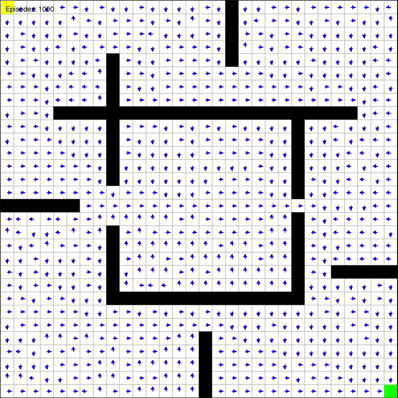

# qlearning-maze-solver
---
1. [Overview](#Overview)
2. [File structure](#file-structure)
3. [Usage](#usage)
4. [Implementation details](#implementation-details)
5. [References](#references)
---
### Overview
An agent is trained using tabular Q-learning to navigate and solve a grid-based maze.

### File structure

```

```
### Usage
##### Setup 
```
# Clone github repository
git clone https://github.com/rakshith-6/qlearning-maze-solver.git

# To install python virtual environment in Debian-based OS run,
sudo apt-get install python3-venv

# Navigate to cloned repository and create virtual environment
cd qlearning-maze-solver
python3 -m venv tabQ_env
source tabQ_env/bin/activate

# Upgrade pip 
python -m pip install --upgrade pip

# Install required libraries
pip install -r requirements.txt
```
##### Run project
```
# Navigate to cloned project repository
cd qlearning-maze-solver
python main.py
```
### Implementation details

<div align="center">
  
</div>

- The environment consists of a 30X30 grid with a start cell at one corner, a goal cell at the opposite corner and a maze layout to navigate.
- The agent learn Q-values corresponding to all the cells(states) in the grid and populates the table of Q-values tabulated against the corresponding states and actions.
- The agent uses an epsilon-greedy policy while learning and will finally extract the path using a greedy policy.

### References
